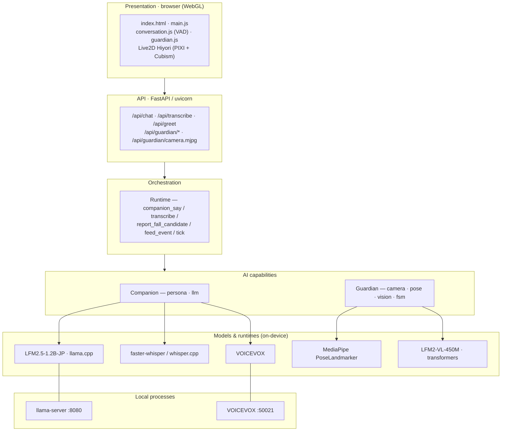
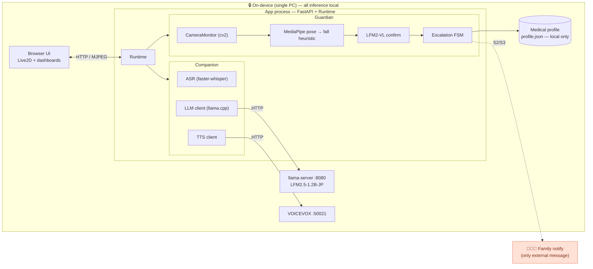
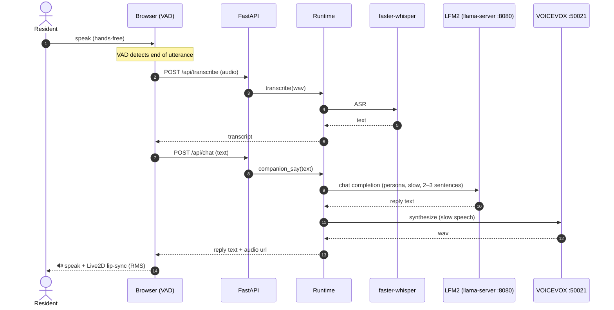
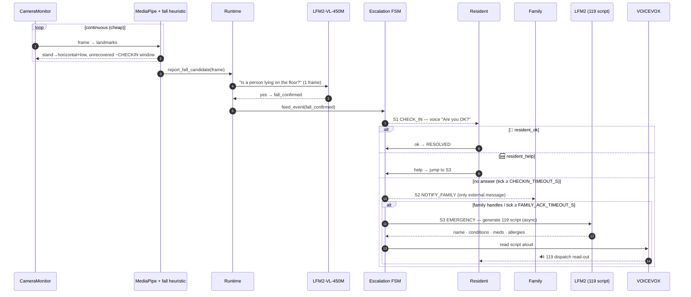

# Technical Summary — 灯 Tomoshibi (Track 1)

> Architecture & structure of the system: tech stack, system diagram, and the two
> core sequences (companion voice turn / guardian fall escalation). Diagrams are
> Mermaid — they render on GitHub; in PDF/plain-text viewers they show as source.

## One-line

A 100% on-device AI companion + 2-stage fall-safety watch for elderly people
living alone. The only data that leaves the device is a family alert.

## Tech stack (layers)

### Models & frameworks

| Role | Model | Framework / runtime | Notes |
|---|---|---|---|
| Dialogue LLM | **LFM2.5-1.2B-JP-202606** (GGUF Q4_K_M) | llama.cpp (OpenAI-compatible HTTP) | Mac=Metal · Ryzen=Vulkan / FastFlowLM NPU |
| Fall confirmation (vision) | **LFM2-VL-450M** | transformers | invoked on ~1 frame only when a fall is suspected; lazy-loaded, own thread |
| Pose / "when to look" | MediaPipe PoseLandmarker (Tasks API, lite) | mediapipe | cheap, continuous, CPU |
| ASR | faster-whisper (Mac) / whisper.cpp (Ryzen) | CTranslate2 / whisper.cpp | VAD-segmented hands-free turns |
| TTS | **VOICEVOX** (cpu-0.25.2) | local HTTP :50021 (Docker) | slow speech for elders |
| Avatar | Live2D (Hiyori) | PIXI + Cubism (WebGL) | RMS lip-sync |
| Observability | W&B Weave (optional, default off) | weave | trace LFM calls |
| UI / orchestration | FastAPI + vanilla HTML/CSS/JS | uvicorn | MJPEG camera stream |

## System architecture

Three local processes; the only thing that ever leaves the home is the family alert.

## Sequence — Companion voice turn

## Sequence — Guardian fall escalation

> FSM phases (`src/tomoshibi/guardian/fsm.py`):
> `MONITORING → CHECK_IN (S1) → NOTIFY_FAMILY (S2) → EMERGENCY (S3)`, plus `RESOLVED`.
> Timeouts are config constants `CHECKIN_TIMEOUT_S` and `FAMILY_ACK_TIMEOUT_S`.

## Key innovation — 2-stage vision cascade

Running a VLM on every frame is infeasible on-device. Cheap MediaPipe decides
*when to look*; the LFM2-VL model does a single semantic confirmation ("is a
person lying on the floor?") only on a candidate frame. Result: low power, high
precision, few false positives — and the heavy model stays mostly idle.

## Deployment & portability

Built and verified on Mac with **all models real**; ships to the assigned AMD
Ryzen AI PC. The app's Python is **unchanged** — only launch flags / runtime
backends differ (the LLM client speaks OpenAI-compatible HTTP either way).

| Component | Mac (dev / verification) | AMD Ryzen AI PC (target) |
|---|---|---|
| Dialogue LFM2 | llama.cpp (Metal) via `run_llm_server.sh` | llama.cpp + Vulkan / FastFlowLM NPU (`.q4nx`) |
| Vision LFM2-VL | transformers (MPS) | transformers (ROCm / CPU) |
| ASR | faster-whisper | faster-whisper or whisper.cpp |
| TTS | VOICEVOX (Docker) | VOICEVOX (Docker Desktop) |
| App | uvicorn | same — point `LLAMACPP_SERVER_URL` at the local server |

Backend selection is by env (`TOMOSHIBI_MODE`, `TTS_BACKEND`, `ASR_BACKEND`,
`LLAMACPP_SERVER_URL`); every backend also has a mock, so the app boots and the
test suite runs with no models present.

## Efficiency by design (qualitative)

- **Quantized dialogue model** — LFM2.5-1.2B-JP in GGUF **Q4_K_M** for a small
  memory footprint on integrated GPU / NPU.
- **VLM only when needed** — LFM2-VL runs on ~**1 frame** per suspected fall, not
  per frame; it is lazy-loaded and warmed on camera start.
- **Cheap continuous layer** — MediaPipe PoseLandmarker (lite) on CPU does the
  always-on watching.
- **Non-blocking** — vision inference and the 119-script generation run on
  separate threads so dialogue is never blocked.
- **No cloud round-trip** — inference cost is compute cycles, not API calls;
  works fully offline.

## Privacy / on-device proof

- All inference is local. PII (medical profile) is stored only on the device.
- The only external message is the family alert (`FAMILY_NOTIFY_CHANNEL=mock`
  keeps even that off the network). Demonstrable live in airplane mode.

## Code map (where the logic lives)

- `src/tomoshibi/guardian/pose.py` — fall heuristic (pure, unit-tested)
- `src/tomoshibi/guardian/vision.py` — LFM2-VL confirmation (English prompt)
- `src/tomoshibi/guardian/fsm.py` — S1→S2→S3 escalation FSM
- `src/tomoshibi/guardian/camera.py` — cv2 + MediaPipe Tasks, MJPEG stream
- `src/tomoshibi/companion/llm.py` — LFM2 (llamacpp / transformers / mock)
- `src/tomoshibi/voice/` — asr.py, tts.py (VOICEVOX), jp_text.py (read-aloud shaping)
- `src/tomoshibi/runtime.py` — integration + async 119 generation
- `src/tomoshibi/webapp/server.py` — FastAPI routes + MJPEG
- Tests: `tests/` — 51 unit + integration (FastAPI TestClient, mock E2E)
